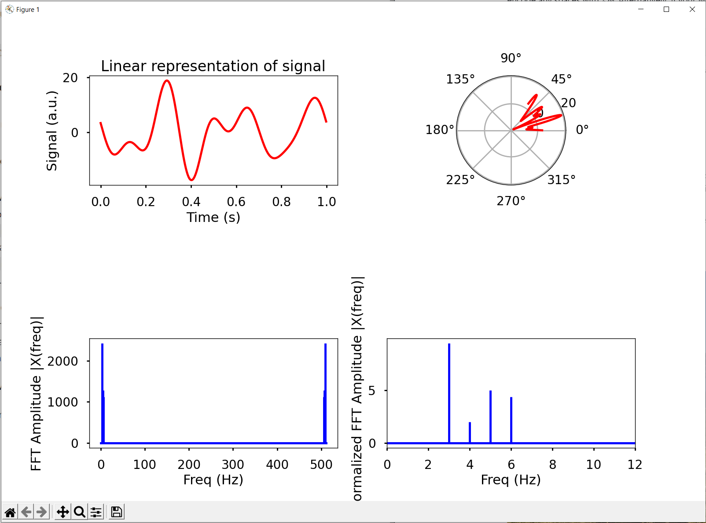

# Textual Fourier

  

## A Fourier Analysis presented using plotting inside the textual framework

## Running the code

`python fourier.py` should get you started.

## Setup
Simply run `pip install -r requirements.txt` to setup all required packages.

## Repo Utils

We use the [pre-commit](https://pre-commit.com/) module to ensure our repo is in tip-top condition. This checks for code formatting, type hints, commit branch etc at commit time. To setup:
`pre-commit install` (can take a few minutes to configure everything)
Can be manually run using:
`pre-commit run --all-files`
but will automatically run when we try and do a `git commit ...`.

NOTE: pre-commit runs in it's own virtual environment which can be a real pain for checking all our imports are correct (as it does not have access to the same PATHs). We have tried to setup `pylint` correctly in the `.pre-commit-config.yaml` file but there may be some issues.

We can force the `git commit` using the `-n` flag. E.g. `git commit -anm "Just do it"`

Pre-commit packages can be updated using the `pre-commit autoupdate` command.
